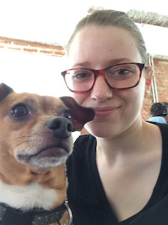

 Hey, I'm Alexandra "Alex" Ulsh! I'm an Information Security Engineer at [Mapbox](https://www.mapbox.com/) in Washington, D.C. I work on everything from running our bug bounty program on [HackerOne](https://hackerone.com/mapbox) to platform security on AWS to making sure everyone at Mapbox has a password manager and knows how to use it.

I love information security (especially web application security), the internet, computers, writing code, and automating everything. Outside of technology I love strength training (especially calisthenics and gymnastics), nutrition, music, dogs 🐶, coffee ☕, foreign languages, and board sports 🏂.

My mission is to demystify the complicated, scary, and overwhelming topics of information security and strength training for others - especially for women, LGBTQ people, and other marginalized communities - so that they feel empowered to secure and strengthen their information, accounts, devices, bodies, minds, and ultimately their lives.

While I love breaking things and finding vulnerabilities, **I believe it's even more important to build and maintain defensive solutions**. I strive to understand the offense in order to build better defenses. I recognize that the largest and most common threats to security for society are [abuse, password reuse, unpatched systems, and phishing as opposed to esoteric 0 day exploits](https://www.facebook.com/notes/facebook-security/preparing-for-the-future-of-security-requires-focusing-on-defense-and-diversity/10154629522900766/?fref=mentions).

For the past few years I've participated in the local DCTech community. I'm the Director of Operations for [Women Who Code DC](https://twitter.com/womenwhocodedc) (WWCDC). Before that I served as one of the leads for WWCDC's [Front End Lab Nights](https://www.meetup.com/Women-Who-Code-DC/) helping local women learn HTML, CSS, and JavaScript. As a member of DCFemTech, I also helped organize DCFemTech's 2nd annual [Hack for Good](https://dcfemtech.github.io/hackforgood.html) hackathon.

Earlier in life I worked for several years with [Microsoft SharePoint](https://en.wikipedia.org/wiki/SharePoint), which is where I first fell in love with both information security and JavaScript. The achievement I'm most proud of from that time period is a set of open source PowerShell scripts I wrote for both [SharePoint 2010](https://github.com/alulsh/SharePoint-2010-STIGs) and [SharePoint 2013](https://github.com/alulsh/SharePoint-2013-STIGs) to automatically and programatically apply the [Defense Information Systems Agency](http://www.disa.mil/) [Security Technical Implementation Guides](https://iase.disa.mil/stigs/Pages/index.aspx) (DISA STIGs) to SharePoint farms in less than 5 minutes.
