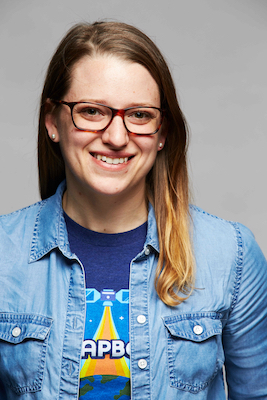

 Hello, I'm Alexandra "Alex" Ulsh! I'm a [developer](/projects), [writer](/blog), [speaker](/talks), and [leader](https://www.linkedin.com/in/alexandraulsh/). I work at [Mapbox](https://www.mapbox.com/) in Washington, D.C.

I build, launch, and improve software products and platforms. I use technical skills, empathy, and customer obsession to grow adoption and increase revenue.

I have over 10 years of experience as a system administrator, information security engineer, community organizer, product manager, and general manager. I have specialized knowledge in JavaScript, Node.js, AWS, containers (Docker and Kubernetes), open-source geospatial tools, application security, identity & access management, compliance (SOC 2 and RMF/ATO), bug bounty program management, and building commercial self-hosted software platforms for customers in restricted environments.

As a colleague, mentor, manager, or friend, I like to help others cultivate more meaningful lives. I practice (and like to teach others about) [digital minimalism](https://www.wbur.org/hereandnow/2019/02/07/digital-minimalism-phone-social-media-addiction), [Getting Things Done](https://hamberg.no/gtd), [Marie Kondo](https://hbr.org/2020/05/lifes-work-an-interview-with-marie-kondo), and [daily time blocking](https://www.calnewport.com/blog/2013/12/21/deep-habits-the-importance-of-planning-every-minute-of-your-work-day/) to create space for [deep work](https://mindful.technology/deep-work-cal-newport/), meaningful hobbies, and rest. Outside of work, I enjoy strength training (both calisthenics and weights), snowboarding, playing guitar, genealogy, and learning foreign languages.